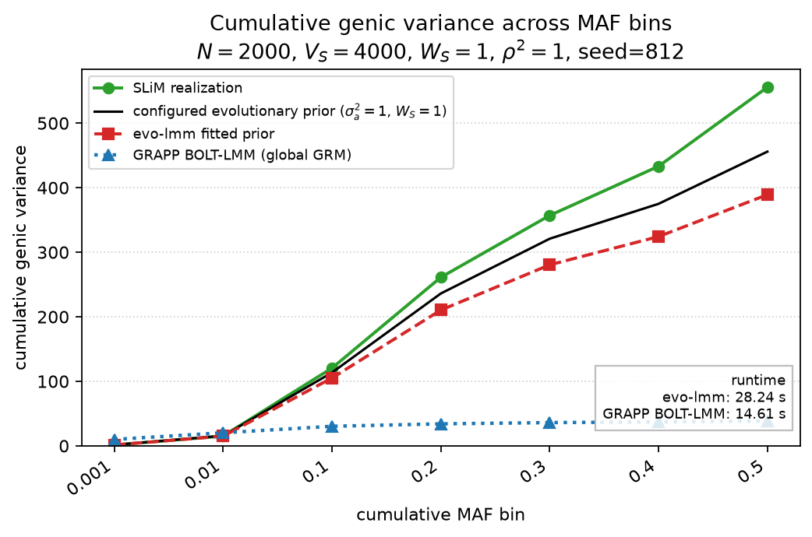

Benchmark against GRAPP BOLT-LMM
================================

This page compares the GRG-backed evolutionary fit with GRAPP's
``bolt_lmm_inf`` implementation on the same explicit forward-simulation data.
It reuses the simulation source and configured parameters from
:doc:`slim_forward_simplified`:

* 2,000 diploid individuals and a ``4N = 8,000`` generation burn-in;
* ``L = 10^6`` bases and ``V_S = 2N = 4,000``, hence
  ``W_S = V_S/(2N) = 1``;
* ``sigma_a^2 = sigma_b^2 = 1`` and the simplified ``rho^2 = 1`` model; and
* residual variance ``sigma_e^2 = 0.4``.

The benchmark uses seed ``812`` and creates one phenotype from the full GRG.
For the fits, the same tree sequence is divided into two physical blocks.
This is an implementation detail required by GRAPP's leave-one-chromosome-out
calibration: with only one block, there is no chromosome left out of the
calibration set. Both blocks retain all 2,000 individuals and their GRGs are
created with coalescent counts enabled for GRAPP's ``XTX`` traversal.

The reported timings cover the fitting calls only. They include each method's
operator setup, variance-component estimation, and method-specific calibration
or trace work, but exclude the shared SLiM simulation, tskit simplification,
and GRG conversion. The exact seconds are machine-dependent and are printed
when the example is run directly. The checked-in figure was generated locally
so hosted documentation builds do not rerun this compute-heavy benchmark.
Both fits use 15 stochastic trials/probes and a ``5e-4`` CG tolerance, matching
GRAPP's defaults for 2,000 individuals. Both implementations batch probe
columns into GRG ``matmat`` traversals. These controls matter: the earlier
benchmark requested 64 probes and a ``1e-8`` tolerance only from evo-lmm, which
made the wall-clock comparison measure a substantially larger numerical-work
budget.

Sequential REML profiling
-------------------------

The following measurements use one shared seed-812 simulation, ``max_iter=8``,
and ``cg_tol=5e-4``. Only the REML fit is timed; the reported fits had not yet
converged at the iteration cap, so the estimates are useful for profiling and
probe-sensitivity rather than final inference. Re-run the exact sweep with
``uv run python docs/tutorials/trace_profile.py``.

.. list-table::
   :header-rows: 1

   * - Configuration
     - Seconds
     - Relative speed
     - sigma_b2
     - tau
     - sigma_e2
     - delta
     - Total CG iterations
   * - Cold Hutchinson, 15 vectors
     - 58.833
     - 1.00x
     - 0.965707
     - 1.615884
     - 0.388107
     - 0.401889
     - 1696
   * - Warm Hutchinson, 15 vectors
     - 25.598
     - 2.30x
     - 0.965676
     - 1.615328
     - 0.388117
     - 0.401912
     - 2
   * - Warm XTrace, 15 vectors
     - 45.840
     - 1.28x
     - 0.953846
     - 1.742215
     - 0.396512
     - 0.415698
     - 6
   * - Warm XTrace, 5 vectors
     - 34.280
     - 1.72x
     - 0.993457
     - 2.866688
     - 0.388782
     - 0.391342
     - 6

Warm starts reduce the cold-Hutchinson fit by 2.30x and reduce aggregate CG
iterations from 1,696 to 2. XTrace with 15 vectors costs 1.79x the warm-
Hutchinson fit because each derivative trace has two operator-query blocks;
reducing XTrace to five vectors cuts that overhead to 1.34x (34.280 s).
Relative to 15 vectors, five vectors shift the fitted ``sigma_b2`` by +4.15%,
``tau`` by +64.54%, ``sigma_e2`` by -1.95%, and ``delta`` by -5.86%. The
reported XTrace standard errors for ``(log_delta, log_tau)`` increase from
``(6.221, 2.247)`` to ``(11.750, 7.101)`` (+88.88% and +216.04%), quantifying
the precision cost of the speedup.

This is not yet evidence that XTrace uniformly improves trace accuracy. In
the same fit, XTrace-15 has a larger ``log_delta`` standard error (6.221 versus
5.109 for Hutchinson-15) but a smaller ``log_tau`` standard error (2.247 versus
3.319). In a separate seeded dense fixture, matched at 10 operator queries,
XTrace-5 versus Hutchinson-10 had RMSE ratios of 1.38 (``log_delta``) and 1.24
(``log_tau``); matched at 30 queries, XTrace-15 versus Hutchinson-30 had ratios
of 1.49 and 1.36. XTrace remains useful as the implemented variance-reduced
alternative, but its default query budget should be selected from these
end-to-end error measurements rather than assumed to dominate Hutchinson.

Cumulative genic variance
-------------------------

For a variant with minor allele frequency ``x``, the genic contribution is
``2*x*(1-x)*E[beta^2 | x]``. The single panel below follows the layout and MAF
bins of Figure A11 in ``stab1_genetics_template.pdf``. It shows the realized
SLiM contribution, the configured evolutionary prior, evo-lmm's fitted prior,
and GRAPP BOLT-LMM's global standardized-GRM allocation.

The GRAPP curve is intentionally described as a global-GRM allocation. BOLT-LMM
assigns the fitted ``sigma_g2`` equally across its ``M`` eligible standardized
markers (``sigma_g2/M`` per marker). In raw-dosage effect notation this is
``E[beta^2 | x] = sigma_g2/(M*2*x*(1-x))``; after multiplying by
``2*x*(1-x)``, each marker contributes ``sigma_g2/M``. Its cumulative curve is
therefore a neutral frequency-independent reference. evo-lmm instead uses the
frequency-dependent simplified prior
``sigma_b^2/(1 + 2*tau*x*(1-x))``.

.. literalinclude:: bolt_benchmark.py
   :language: python
   :linenos:

Prepare the simulation and GRG artifacts once from the repository root with:

.. code-block:: console

   uv run python docs/tutorials/prepare_bolt_benchmark.py

Then rerun only the LMM fitting comparison as often as needed with:

.. code-block:: console

   uv run python docs/tutorials/fit_bolt_benchmark.py

The prepared files are stored under ``docs/_artifacts/`` (ignored by Git).
Running ``bolt_benchmark.py`` or the figure generator automatically reuses
that directory when it exists; otherwise it falls back to a temporary
simulation.

The fit-only rerun with the optimized Hutchinson default reported:

.. list-table::
   :header-rows: 1

   * - Method
     - Fit seconds
     - sigma_b2
     - tau
     - sigma_e2
   * - evo-lmm (warm Hutchinson, 15 vectors)
     - 25.536
     - 0.965676
     - 1.615329
     - 0.388117
   * - GRAPP BOLT-LMM
     - 10.708
     - 38.614655 (sigma_g2)
     - n/a
     - n/a

This is a 2.45x evo-lmm speedup over the earlier cold-start profile on the
same workload; GRAPP remains 2.38x faster in absolute fit time.

The figure is pre-generated locally so ReadTheDocs does not rerun SLiM, GRG
conversion, or either fitted model. Regenerate it with
``uv run python docs/generate_figures.py``.

