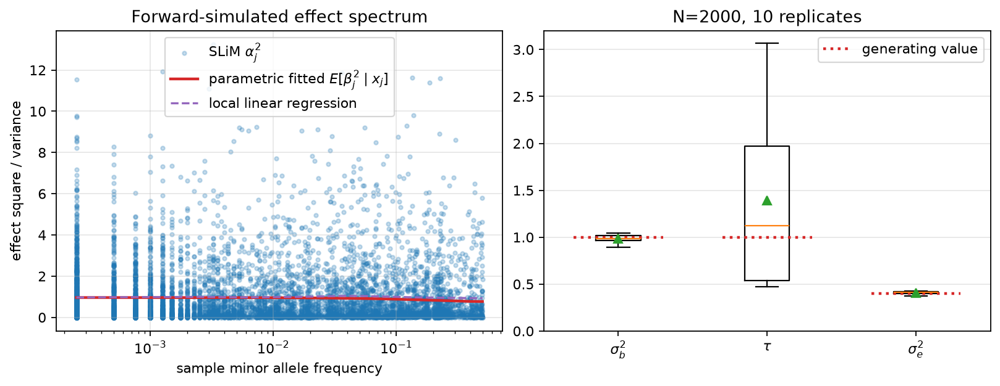

Explicit forward simulation with SLiM
=====================================

This tutorial uses SLiM to generate ten independent populations under the
simplified evolutionary model, then fits evo-lmm to the sampled genotypes and
phenotypes. Its purpose is to check the model in the setting from which its
frequency-dependent prior is derived: mutation, drift, recombination, and
stabilizing selection jointly determine which variants are segregating and
their effects :cite:p:`LeeTerhorst2026`.

It is tempting to draw variant effects from the final conditional prior,
simulate ``y = G beta + e``, and fit the same model back to those data. That is
a useful numerical check of the fitting code, but it is not a check of the
evolutionary argument. In the model specification, the key step is the
effect-dependent site-frequency spectrum ``p(G_j | alpha_j)``: stabilizing
selection changes the chance that a mutation with a given latent effect is
observed at a particular frequency. Conditioning that population process on
the sampled genotype is what yields ``E[beta_j^2 | G_j]``. A direct regression
simulation assumes this relationship rather than generating it, and omits the
finite-population and linkage effects that accompany it. Forward simulation
therefore provides the appropriate end-to-end experiment.

The SLiM model follows the forward-simulation design described in
:cite:p:`LeeTerhorst2026`. Mutations have normally distributed latent effects, fitness is
``exp(-phenotype^2 / (2 * V_S))``, and ``W_S = V_S / (2N)`` is the
dimensionless selection-width parameter. This tutorial uses the simplified
``rho^2 = 1`` case, for which the focal and selected effects agree:
``beta_j = alpha_j``.

Prerequisites
-------------

SLiM is an external executable rather than a Python dependency of this
project. Check that it is available before running the example:

.. code-block:: console

   slim -v

The project environment supplies ``tskit``, ``pygrgl``, and ``evo_lmm``. The
complete SLiM source is included as :download:`slim_simplified_prior.slim`.

The forward model
-----------------

The simulation fixes a diploid population of 2,000 individuals, runs for
``4N = 8,000`` generations across ``L = 10^6`` bases, and records a tree
sequence. It uses ``V_S = 2N = 4,000``, hence ``W_S = 1``. The complete SLiM
source is included in the following expandable block.

.. dropdown:: Show the SLiM model
   :color: light

   .. literalinclude:: slim_simplified_prior.slim
      :language: slim
      :linenos:

SLiM records the mutation effects in tree-sequence metadata. The production
scripts separate burn-in and replicate runs; this compact version combines the
essential steps for a reproducible example.

SLiM to GRG to evo-lmm
----------------------

For each replicate, the driver simplifies the extant samples with ``tskit``,
converts the tree sequence with ``pygrgl.grg_from_trees``, computes sample
allele frequencies, and uses the raw GRG dosage operator to form genetic
values from the metadata-derived effects. The GRG is a compact, lossless
representation that supports these graph-native operations
:cite:p:`DeHaasPanWei2025`. The driver then adds residual noise and fits the
simplified model. Simplification is needed because SLiM's recording also marks
historical nodes as samples.

.. dropdown:: Show the Python driver
   :color: light

   .. literalinclude:: slim_forward_simplified.py
      :language: python
      :linenos:

Run it from the repository root with:

.. code-block:: console

   uv run python docs/tutorials/slim_forward_simplified.py

The fitted ``sigma_b2`` and ``tau`` are finite-sample estimates, not exact
recovery targets. The short population history and one phenotype vector per
replicate leave limited information about the frequency-shape parameter.
Inspect ``FitDiagnostics`` before interpreting an individual fit.

Summary figure
--------------

The script produces a two-panel summary. The left panel compares realized
``alpha_j^2`` values among segregating variants in the first replicate with two
summaries on the minor-allele-frequency scale. The solid red curve is the
fitted evolutionary prior
``E[beta_j^2 | x_j] = sigma_b2 / (1 + 2 * tau * x_j * (1 - x_j))``;
the dashed purple curve is a local linear summary of the same segregating
variants. Folding to minor allele frequency displays the symmetry in
``x * (1 - x)`` directly. The right panel shows fitted variance components
across all ten replicates; dotted segments mark their generating values.

