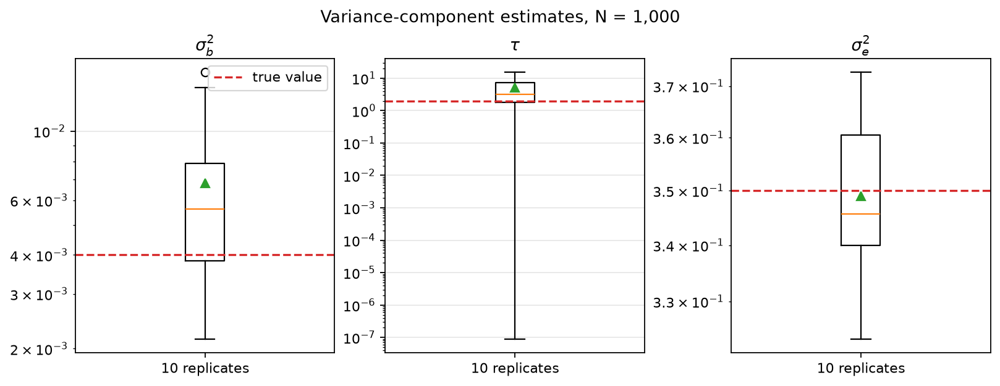

Variance-component estimation with 1,000 individuals
=====================================================

This tutorial repeats a seeded phenotype simulation ten times with 1,000
individuals. Each replicate samples raw dosage effects from the simplified
evolutionary prior, adds residual noise, and estimates the variance components
with profiled AI-REML. The final figure is a box plot of the ten estimates;
the horizontal line in each panel is the generating value.

The example uses a broad, fixed allele-frequency spectrum so that the
frequency-dependent ``tau`` parameter is visible in a modest simulation. The
same fitting call can consume a GRG through the matrix-free BOLT-style API;
the dense construction here keeps the ten-replicate tutorial quick and makes
the simulation boundary easy to inspect.

Simulation and fitting code
---------------------------

.. dropdown:: Show the simulation and fitting code
   :color: light

   .. literalinclude:: variance_components.py
      :language: python
      :linenos:

The script uses seeded Hutchinson trace estimates. The estimate of
``sigma_e2`` is usually tighter than the shape estimate ``tau`` because a
single phenotype vector contains less information about the frequency shape.
For that reason the panels use logarithmic y-axes and show all ten replicates,
including fits that land near the ``tau=0`` boundary.

Replicate estimates
-------------------

The result below is a pre-generated local asset. The source remains available
above, but ReadTheDocs does not need to rerun the ten-replicate fit.

The box plot is a compact Monte Carlo diagnostic, not a replacement for
``FitDiagnostics``. In a real analysis, inspect convergence, trace standard
errors, AI conditioning, and boundary warnings alongside the point estimates.
